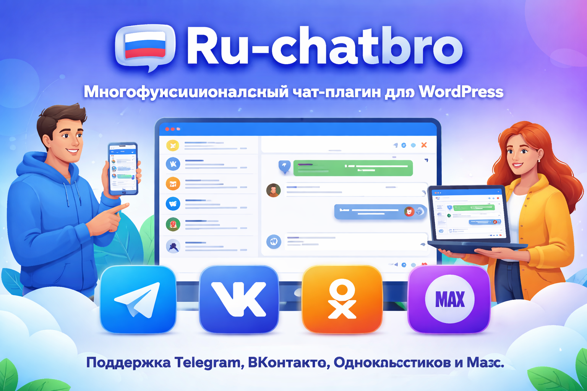

# 🗣️ Ru‑chatbro – многофункциональный чат‑плагин для WordPress

[Русская версия](#-ruchatbro--многофункциональный-чатплагин-для-wordpress) | [English version](#-ruchatbro--multifunctional-chat-plugin-for-wordpress)

---

  

## 🇷🇺 Ru‑chatbro – многофункциональный чат‑плагин для WordPress

**Ru‑chatbro** – это мощный и гибкий плагин для WordPress, который превращает ваш сайт в единую точку общения с посетителями.  
Плагин интегрируется с популярными мессенджерами (**Telegram**, **ВКонтакте**, **Одноклассники**, **Макс**) и не требует ежемесячной оплаты без сторонних сервисов и скрытых тарифов.

---

### 🚀 Основные возможности

#### 🧩 Создание неограниченного количества чатов
- Каждый чат можно настроить индивидуально
- Выбор режима отображения: на всём сайте, только по шорткоду, по списку URL
- Поддержка масок URL (например, `/blog/*`) для гибкого показа

#### 🔌 Интеграция с мессенджерами
- **Telegram** – бот в группе/канале, синхронизация в обе стороны
- **ВКонтакте** – подключение через токен сообщества, Long Poll API
- **Одноклассники** – работа через приложение, Access Token, Long Poll
- **Макс** – подключение через бота, получение ID чата
- Все мессенджеры работают одновременно в рамках одного чата

#### 📌 Шорткоды для гибкого размещения
| Шорткод | Описание |
|---------|----------|
| `[ru_chatbro id="1"]` | Плавающий виджет (кнопка снизу справа) |
| `[ru_chatbro id="1" inline="true"]` | Встроенный чат прямо на странице |
| `[ru_chatbro id="1" width="400px"]` | Задать ширину |
| `[ru_chatbro id="1" height="500px"]` | Задать высоту |
| `[ru_chatbro id="1" width="100%" inline="true"]` | Встроенный чат на всю ширину |

#### 🌐 Режимы отображения
- **Только шорткод** – чат появляется только там, где вставлен шорткод
- **На всём сайте** – чат автоматически показывается на всех страницах (можно исключить URL)
- **По списку URL** – чат показывается только на указанных страницах (поддержка масок `*`)

#### 🎨 Внешний вид – полная настройка без CSS
- Цвета: заголовок, фон, кнопки, сообщения, ссылки
- Шрифты: 6 вариантов (системный, Inter, Roboto, Open Sans, Montserrat, Nunito)
- Размеры: ширина, высота, высота заголовка
- Позиционирование: право/лево, верх/низ, отступы
- Скругления: чата, сообщений, кнопки, аватаров
- Дополнительно: аватары, дата, иконки источника, счётчик участников, тень

#### 🔐 Безопасность и производительность
- CSS и JS загружаются только на страницах с чатом
- Синхронизация через WP‑Cron (не блокирует загрузку страниц)
- Возможность анонимных сообщений без регистрации
- Опция требовать регистрацию для защиты от спама

---

### 📊 Управление чатами и интеграциями

#### 📝 Создание и настройка чата
- Название чата, выбор активных мессенджеров
- Переключатели для анонимных сообщений, требования регистрации
- Автоматическая проверка токенов и ID чатов

#### ⚙️ Централизованные настройки
- Раздел **Ru‑chatbro → Настройки** с вкладками:
  - **Отображение** – режимы, выбор чата, исключения
  - **Telegram** – токен бота, ID группы
  - **ВКонтакте** – токен сообщества, ID группы
  - **Одноклассники** – App ID, Access Token, ID группы
  - **Макс** – токен бота, ID чата
  - **Внешний вид** – все визуальные настройки

#### 🔄 Синхронизация в реальном времени
- Telegram: Long Polling каждые 30 секунд
- ВКонтакте: Long Poll API
- Одноклассники: Long Poll
- Макс: Long Poll
- Сообщения передаются в обе стороны: сайт ↔ мессенджер

---

### 📜 Встроенная документация и подсказки
- Пошаговые инструкции по получению токенов для каждого мессенджера
- Подробный FAQ в административной панели
- Примеры масок URL для режима по списку

---

### ✅ Статус проекта
- Все функции протестированы на WordPress 5.8 – 6.5
- PHP 7.4 – 8.2
- Готов к использованию в продакшене
- Регулярно обновляется

---

### 🛠️ Подходит для
- Интернет-магазинов (поддержка клиентов)
- Корпоративных сайтов (единый чат с сотрудниками)
- Сообществ и блогов (объединение аудитории)
- Образовательных проектов (консультации)
- Любого сайта, где нужен диалог с посетителями

---

### 📌 Лицензия
GPL v2 or later

---

👨‍💻 **Автор:** Сергей Солошенко (RuCoder)  
🛠 **Специализация:** Веб-разработка с 2018 года | WordPress / Full Stack  
📬 **Email:** support@рукодер.рф  
📲 **Telegram:** @RussCoder  
🌐 **Портфолио:** https://рукодер.рф  
📁 **GitHub:** https://github.com/RuCoder-sudo

Если нужна кастомизация под ваш проект или установка «под ключ» – пишите в личные сообщения.

---

---

## 🇺🇸 Ru‑chatbro – Multifunctional Chat Plugin for WordPress

**Ru‑chatbro** is a powerful WordPress plugin that turns your website into a central communication hub. It integrates with popular messengers (**Telegram**, **VKontakte**, **Odnoklassniki**, **Max**) and requires no monthly fees.

---

### 🚀 Key Features

#### 🧩 Unlimited Chats
- Individual settings for each chat
- Display modes: shortcode only, sitewide, by URL list
- URL masks support (e.g., `/blog/*`)

#### 🔌 Messenger Integration
- **Telegram** – bot in group/channel, two‑way sync
- **VKontakte** – community token, Long Poll API
- **Odnoklassniki** – app‑based, Access Token, Long Poll
- **Max** – bot token, chat ID retrieval
- All messengers can work simultaneously in one chat

#### 📌 Shortcodes
| Shortcode | Description |
|-----------|-------------|
| `[ru_chatbro id="1"]` | Floating widget (button bottom‑right) |
| `[ru_chatbro id="1" inline="true"]` | Embedded chat inline |
| `[ru_chatbro id="1" width="400px"]` | Set width |
| `[ru_chatbro id="1" height="500px"]` | Set height |
| `[ru_chatbro id="1" width="100%" inline="true"]` | Full‑width embedded chat |

#### 🌐 Display Modes
- **Shortcode only** – chat appears only where shortcode is placed
- **Sitewide** – shown on all pages (URLs can be excluded)
- **By URL list** – shown only on specified pages (masks supported)

#### 🎨 Full Appearance Customization
- Colors, fonts, dimensions, positioning, borders, shadows
- Optional elements: avatars, timestamps, source icons, participant counter

#### 🔐 Performance & Security
- CSS/JS loaded only on pages with chat
- WP‑Cron‑based sync (doesn’t block page load)
- Anonymous messages or registration‑required modes

---

### 📊 Chat & Integration Management

- Create chats with custom names and active messengers
- Central settings page with tabs for each messenger
- Real‑time sync via Long Poll / WP‑Cron
- Step‑by‑step token retrieval instructions inside admin panel

---

### ✅ Project Status
- Tested with WordPress 5.8 – 6.5
- PHP 7.4 – 8.2
- Production‑ready, regularly updated

---

### 🛠️ Suitable for
- E‑commerce stores (customer support)
- Corporate sites (team communication)
- Communities & blogs (audience engagement)
- Educational projects (consultations)
- Any website needing real‑time dialogue

---

### 📌 License
GPL v2 or later

---

👨‍💻 **Author:** Sergey Soloshenko (RuCoder)  
📬 **Email:** support@рукодер.рф  
📲 **Telegram:** @RussCoder  
🌐 **Portfolio:** https://рукодер.рф  
📁 **GitHub:** https://github.com/RuCoder-sudo
